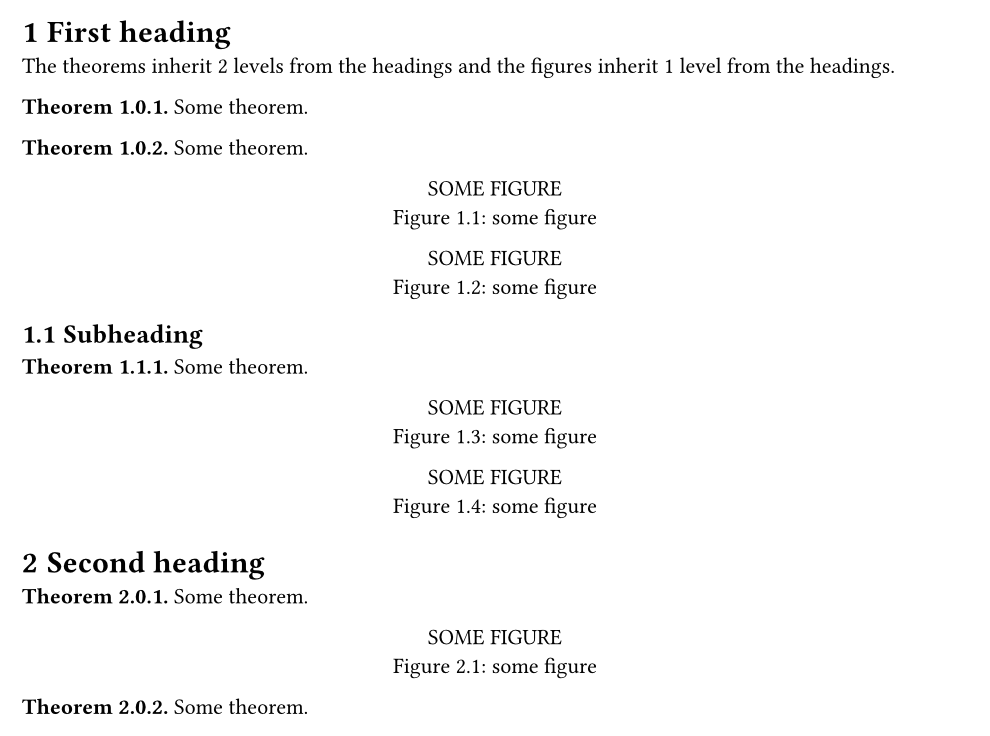

> [!NOTE]
> This is a [Typst](https://typst.app/) package. Click [here](https://typst.app/universe/package/headcount/) to find it in the Typst Universe.

# `headcount`

This package allows you to make **counters depend on the current chapter/section number**.

This works for **figures, theorems, and any other counters**.

The advantage compared to [rich-counters](https://typst.app/universe/package/rich-counters/) is that you stick with native `counter`s and you can influence e.g. the `figure` counter directly without writing a new `show` rule with a custom counter or so.

## Showcase for [figures](https://typst.app/docs/reference/model/figure/)

To make the figure counter depend on the chapter number, you have to:

1. Enable numbering for headings by specifying a [numbering pattern or function](https://typst.app/docs/reference/model/heading/#parameters-numbering).
2. Let figures inherit the chapter number by passing `dependent-numbering` to its `numbering` parameter.
3. Reset the figure counter when appropriate by calling `reset-counter` in a show rule.

Here's an example:

```typ
#import "@preview/headcount:0.1.0": dependent-numbering, reset-counter

#set heading(numbering: "1.1")
#set figure(
  numbering: dependent-numbering("1-1")
)
#show heading: reset-counter(
  counter(figure.where(kind: image))
)
```

```typ
= Chapter
#figure(image(…), caption: […]) <fig>
// 🖼️ Figure 1-1

== Section
#figure(image(…), caption: […])
// 🖼️ Figure 1-2

= Another chapter
#figure(image(…), caption: […])
// 🖼️ Figure 2-1

References are also supported:
@fig will become “Figure 1-1”.
```

To depend on the _section_ number instead, just set `levels` to `2` (the default is `1`):

```typ
#set figure(
  numbering: dependent-numbering("1.1.1", levels: 2), // 👈
)
#show heading: reset-counter(
  counter(figure.where(kind: image)),
  levels: 2, // 👈
)
```

## Showcase for [great-theorems](https://typst.app/universe/package/great-theorems)

In the following example, we demonstrate how you can inherit 1 level of the heading counter for figures and 2 levels for theorems.

```typ
#import "@preview/headcount:0.1.0": *
#import "@preview/great-theorems:0.1.0": *

#show: great-theorems-init

#set heading(numbering: "1.1")

// construct theorem environment with counter that inherits 2 levels from heading
#let thmcounter = counter("hello")
#let theorem = mathblock(
  blocktitle: [Theorem],
  counter: thmcounter,
  numbering: dependent-numbering("1.1", levels: 2)
)
#show heading: reset-counter(thmcounter, levels: 2)

// set figure counter so that it inherits 1 level from heading
#set figure(numbering: dependent-numbering("1.1"))
#show heading: reset-counter(counter(figure.where(kind: image)))

= First heading

The theorems inherit 2 levels from the headings and the figures inherit 1 level from the headings.

#theorem[Some theorem.]
#theorem[Some theorem.]
#figure([SOME FIGURE], caption: [some figure])
#figure([SOME FIGURE], caption: [some figure])

== Subheading

#theorem[Some theorem.]
#figure([SOME FIGURE], caption: [some figure])
#figure([SOME FIGURE], caption: [some figure])

= Second heading

#theorem[Some theorem.]
#figure([SOME FIGURE], caption: [some figure])
#theorem[Some theorem.]
```


## Usage

To make another `counter` inherit from the heading counter, you have to do **two** things.

1. For the numbering of your counter, you have to use `dependent-numbering(...)`.

   - `dependent-numbering(style, levels: 1, pad-zeros: true)` (needs `context`)

     Is a replacement for the `numbering` function, with the difference that it precedes any counter value with `levels` many values of the heading counter.

   ```typ
   #import "@preview/headcount:0.1.0": *

   #set heading(numbering: "1.1")

   #let mycounter = counter("hello")

   = First heading

   #context mycounter.step()
   #context mycounter.display(dependent-numbering("1.1")) // 👈✅ 1.1

   = Second heading

   #context mycounter.step()
   #context mycounter.display(dependent-numbering("1.1")) // 👈❌ 2.2

   #context mycounter.step()
   #context mycounter.display(dependent-numbering("1.1")) // 👈❌ 2.3
   ```

   This displays the desired amount of levels of the heading counter in front of the actual counter.
   However, as you can see in the code above, our actual counter does not yet reset in each section.

2. For resetting the counter at the appropriate places, you need to equip `heading` with the `show` rule that `reset-counter(...)` returns.

   - `reset-counter(counter, levels: 1)` (needs `context`)

     Returns a function that should be used as a `show` rule for `heading`. It will reset `counter` if the level of the heading is less than or equal to `levels`.

   **Important:** This `show` rule should be placed as the _last_ `show` rule for `heading`, or at least after `show` rules for `heading` that employ a custom design, see [here](https://forum.typst.app/t/i-figured-broken-with-custom-template/1730/10?u=jbirnick) for an explanation.

   ```typ
   #import "@preview/headcount:0.1.0": *

   #set heading(numbering: "1.1")

   #let mycounter = counter("hello")
   #show heading: reset-counter(mycounter, levels: 1) // 👈 Add this line

   = First heading

   #context mycounter.step()
   #context mycounter.display(dependent-numbering("1.1")) // 👈✅ 1.1

   = Second heading

   #context mycounter.step()
   #context mycounter.display(dependent-numbering("1.1")) // 👈✅ 2.1

   #context mycounter.step()
   #context mycounter.display(dependent-numbering("1.1")) // 👈✅ 2.2
   ```

## Reference of arguments

### `levels`

_Default: `1`_

Number of heading levels that should be prepended to the counter.

**Note:** The `levels` that you pass to `dependent-numbering(...)` and the `levels` that you pass to `reset-counter(...)` must be the _same_.

### `pad-zeros`

_Default: `true`_

By default, this function will pad zeros for the heading counter, if `dependent-numbering` is displayed before the first heading.
You could set `pad-zeros: false` to turn off this behaviour.

In the following example with `levels: 2`, Figure A comes before the first level-2 heading.
It will be numbered as `1.0.1` by default, and as `1.1` if `pad-zeros: false`.

```typ
#set figure(numbering: dependent-numbering(
  "1.1.1",
  levels: 2,
  pad-zeros: true, // or false
))
#show heading: reset-counter(
  counter(figure.where(kind: image)),
  levels: 2,
)

#set heading(numbering: "1.1")

= Section 1
#figure(rect(), caption: [A])
// ☝️ Figure 1.0.1 if pad-zeros,
// or Figure 1.1 if not

== Section 1.1
#figure(rect(), caption: [B])
// ☝️ Figure 1.1.1, always
```

If `pad-zeros: false`, you can further customize the numbering by leveraging [numbly](https://typst.app/universe/package/numbly) or even functions.
For example:

```typ
#import "@preview/numbly:0.1.0": numbly
#set figure(numbering: dependent-numbering(
  numbly(
    "never-hit",
    "Heading {1}, Figure {2}",
    "Heading {1}-{2}, Figure {3}",
  ),
  levels: 2,
  pad-zeros: false,
))
```

## Limitations

### Remember to `reset-counter` if you update `counter(heading)` manually

Due to current Typst limitations, there is no way to detect manual updates or steps of the heading counter, like `counter(heading).update(...)` or `counter(heading).step(...)`.
Only occurrences of actual `heading`s can be detected.
So make sure that after you call e.g. `counter(heading).update(...)`, you place a heading directly after it, before you use any counters that depend on the heading counter.

### Use canonical `ref` if possible

Due to current Typst limitations, the context of `dependent-numbering` is not correct if the `ref` has been reconstructed in a `show` rule, making the displayed `counter(heading)` wrong.

To be specific, in the following simple example, referencing `dependent-numbering` in other sections works as expected.

```typ
#set figure(numbering: dependent-numbering("1.1"))
#show heading: reset-counter(counter(figure.where(kind: image)))

#set heading(numbering: "1")

= Section 1
#figure(rect(), caption: [A]) <fig:a> // 👈✅ 1.1

= Section 2
@fig:a // 👈✅ 1.1
```

However, if the `ref` has been reconstructed in a `show` rule, then it will give the _current_ context to the heading counter, rather than the context at Figure A.

```typ
// ...

#show ref: it => {
  let el = it.element
  if el != none {
    link(el.location(), {
      el.supplement
      [ ]
      numbering(el.numbering, ..counter(el.func()).at(el.location()))
    })
  } else {
    it
  }
}

= Section 2
@fig:a // 👈❌ 2.1
```

Note that only reconstructed `ref`s are affected. The following `show` rules do not reconstruct `it`, and canonical `ref`s still work.

```typ
#show ref: set text(blue)
#show ref: it => box(stroke: purple, inset: 5pt, underline(it))

= Section 2
@fig:a // 👈✅ 1.1
```

To mitigate it, you could try either of the following.

- Replace `counter("…")` with `counter(figure.where(kind: "…"))`, removing the need of customizing `ref` by reconstruction
- Use [rich-counters](https://typst.app/universe/package/rich-counters) instead
- Save the number in `metadata`, and retrieve it in `ref` (e.g., [theoretic](https://typst.app/universe/package/theoretic))

(sorted from minimal hack to heavy hack)

Please refer to [the issue](https://github.com/jbirnick/typst-great-theorems/issues/4) for further information.
